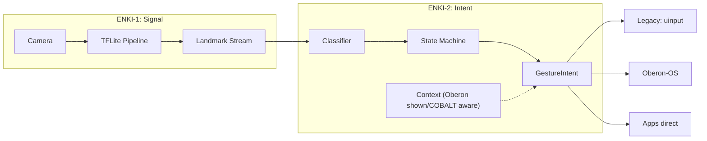

# ENKI Architecture v2 — The Two-Layer Split

ENKI is not one system. It's two.

---

## ENKI-1: The Signal Layer (Vision)

**What it does:** Raw camera frames → clean, structured landmark data. Pure signal processing. No interpretation.

```
Camera → TFLite (palm + landmark) → 21×3 landmarks → output
```

**Output:** Structured landmark packet. Every frame:
```rust
pub struct SignalFrame {
    pub timestamp: u64,
    pub hands: Vec<HandSkeleton>,
}

pub struct HandSkeleton {
    pub landmarks: [Vec3; 21],
    pub handedness: f32,
    pub confidence: f32,
}
```

**No classification. No interpretation. No state.** This is the hardware abstraction layer. Swappable camera sources, swappable ML backends. The output is always "here are the hands, where they are, how sure I am."

---

## ENKI-2: The Intent Layer

**What it does:** Signal → semantic intent. This is where gesture becomes input.

```
Landmarks → classifier → state machine → context → GestureIntent
                                        ↑
                              optional: Oberon/COBALT context
```

**The key insight:** Intent parsing is a spectrum from heuristics to AI. Build it incrementally.

### Level 1: Heuristic (Standalone)

Pure gesture vocabulary. Predefined thresholds. Works anywhere, no external deps.

```rust
pub struct GestureIntent {
    pub gesture: Gesture,         // the classified gesture
    pub strength: f32,            // 0.0 - 1.0
    pub position: Vec3,           // where in space
    pub confidence: f32,          // how sure the classifier is
    pub transition: Option<Transition>, // just started / just ended / held
}
```

Gesture vocabulary:
- **Pinch** — strength from thumb-index distance
- **Point** — direction from index finger vector
- **Swipe** — velocity from wrist movement
- **Grab** — strength from palm curl
- **Tap** — fast pinch-release cycle
- **Peace / Spread / Fist** — finger count patterns

State machine tracks gesture lifecycle:

```
Idle → PinchStart → PinchHeld (drag) → PinchEnd → Idle
                                                ↘ Tap (if fast)
```

### Level 2: Context-Aware (With Oberon)

Oberon tells ENKI-2 what's on screen:
- App currently focused
- Interactive elements near the user's hand
- System state ("in a menu" vs "in a 3D viewport")

ENKI-2 uses this to disambiguate: "A pinch near a button = click intent. A pinch near a 3D model = grab intent."

### Level 3: Full Disambiguation (With COBALT)

COBALT feeds in:
- User's recent actions and history
- Voice intent parsed in parallel
- Long-term context ("they've been working on this engine model for 20 minutes")

ENKI-2's fuzzy gesture + COBALT's system awareness → precise action.

---

## The Pipeline



---

## Design Principle

**ENKI-1 knows nothing about intent. ENKI-2 knows nothing about vision.**

They communicate over a defined protocol. ENKI-2 can be rewritten, replaced, or upgraded without touching the vision pipeline. ENKI-1 can swap camera backends (webcam → OAK-D → phone camera) without changing gesture logic.

---

## Incremental Build Path

| Step | What works | COBALT needed? |
|------|-----------|----------------|
| 1 | Camera → landmarks on screen (debug) | No |
| 2 | Heuristic classifier: pinch → click, point → cursor | No |
| 3 | State machine: drag, swipe, tap | No |
| 4 | Oberon socket: full 3D gesture stream | No |
| 5 | Context-aware disambiguation (Oberon tells ENKI-2 what's focused) | No |
| 6 | COBALT integration: intent augmentation | Yes |

Step 6 is optional. Steps 1-5 build a complete, useful gesture input system.

---
↗ Up: [ENKI](ENKI.md)

## See also
  - [[Strategy|ENKI — Strategic Thinking]]
