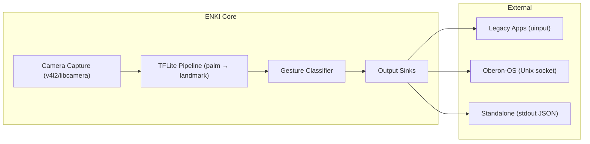

# ENKI — Design Iterations

This document traces the thinking behind ENKI's architecture. Every choice here was arrived at iteratively — through discussion, dead ends, and reconsideration.

---

## Iteration 0: The Original Vision

ENKI was conceived as the vision/sensor kernel for Oberon-OS. The idea: camera-based hand tracking that replaces mouse and keyboard as primary input.

**Target:** Raspberry Pi 3B+ (1GB RAM, Cortex-A53, VideoCore IV).

**Original stack:** C++17 + MediaPipe + OpenCV + uinput.

---

## Iteration 1: The Pi 3B+ Problem

MediaPipe Hands on Pi 3B+ CPU-only struggles to hit 10 FPS. The ML model is the bottleneck — can't code your way through it without dedicated hardware.

### Considered: OAK-D (Luxonis)

A dedicated depth camera with built-in Myriad X VPU that runs hand tracking on-device. Pi receives landmarks over USB with zero ML load.

**Why not:** Cost (~$150), hardware dependency (locks ENKI to specific hardware), not universally available.

**Lesson learned:** Dedicated HW is the pragmatic choice but conflicts with the goal of a universal gesture input system.

---

## Iteration 2: MediaPipe or Nothing?

If OAK-D is out, the ML runs on the main CPU. MediaPipe framework is itself a heavyweight dependency — Bazel build system, hundreds of MB, complex cross-compilation.

### The Realization

MediaPipe is just a wrapper around TFLite models. The actual hand tracking is two `.tflite` model files:
- `palm_detection.tflite` — finds hands in a frame
- `hand_landmark.tflite` — returns 21×3 landmarks from a cropped ROI

These models can be run with **just the TFLite C API** — no MediaPipe framework, no Bazel, no OpenCV.

### New constraint: Drop MediaPipe, keep TFLite

Camera → TFLite C API → landmarks → gesture classifier → output.

Dependencies drop from ~200MB to ~5MB (the `.so`).

---

## Iteration 3: Language Choice

The original ENKI was C++17. With MediaPipe gone, C++ was no longer forced. Comparison:

| | C++17 | Rust |
|---|---|---|
| Build system | CMake + FetchContent | Cargo |
| Camera | OpenCV / v4l2 | `v4l2` crate |
| TFLite binding | C API (direct) | unsafe FFI (thin wrapper) |
| uinput binding | C library | `uinput` crate |
| Gesture classification | verbose, manual enum | algebraic enums + pattern matching |
| Memory safety | manual | compiler-enforced |
| ARM cross-compile | complex (toolchain + sysroot) | `cargo build --target aarch64-unknown-linux-gnu` |
| Error handling | exceptions / error codes | `Result<T, Error>` (thiserror) |

**Decision: Rust.**

The gesture classifier alone is enough — pattern matching on hand landmark data is cleaner in Rust. Everything else (safety, build system, cross-compilation) is bonus.

---

## Iteration 4: Dropping the Pi 3B+ Constraint

The original Pi 3B+ target forced extreme optimization. But it also forced compromises:

- 1GB RAM barely enough for Linux + TFLite + camera + uinput
- VideoCore IV GPU (OpenGL ES 2.0 only) meant no GPU acceleration for ML
- ARM Cortex-A53 would bottleneck at higher resolutions

**New target:** Orange Pi 3B (RK3566, 4-8GB RAM, Mali G52). ENKI still runs on Pi 3B+ at reduced resolution, but it's no longer the design constraint.

**Hardware independence** remains a principle: ENKI runs on any Linux with a camera. Just performant enough for real-time on modern ARM SBCs.

---

## Iteration 5: Revisiting ENKI's Scope

During discussion, it became clear that ENKI is a **drop-in input replacement** — like a mouse and keyboard. It should:

1. Work on any Linux (install on Arch, run as a service)
2. Inject standard input events for legacy apps (uinput)
3. Provide a native protocol for spatial apps (Oberon socket)
4. Be completely independent of Oberon-OS

This means ENKI has value *without* Oberon. It's the universal gesture input layer for all of Linux.

---

## Final Architecture

## What Changed From The Original Plan

| Before | After |
|--------|-------|
| C++17 | Rust |
| MediaPipe framework | TFLite C API (direct FFI) |
| OpenCV | `v4l2` crate (no OpenCV) |
| Pi 3B+ constrained | Orange Pi 3B target, Pi 3B+ optional |
| Single output (uinput) | Three outputs: uinput + Oberon socket + stdout |
| Tightly coupled to Oberon | Independent product, works standalone |

---
↗ Up: [ENKI](ENKI.md)

## See also
  - [[Strategy|ENKI — Strategic Thinking]]
