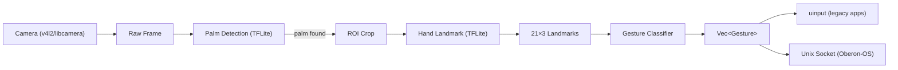

# ENKI — Hand Gesture Input Pipeline

ENKI is the vision/sensor kernel for the Oberon ecosystem. It turns camera frames into gesture events — clean, semantic input that Oberon-OS consumes as spatial input.

## One-Line

Camera → TFLite landmarks → gesture classification → uinput + Oberon socket.

## The Stack

| Layer                  | Language     | Technology                                             |
| ---------------------- | ------------ | ------------------------------------------------------ |
| Camera capture         | Rust         | `v4l2` / `libcamera` — raw frames, no OpenCV           |
| ML inference           | Rust + C FFI | `libtensorflowlite_c.so` — palm + hand_landmark models |
| Gesture classification | Rust         | Pure functions, pattern matching on 21×3 landmarks     |
| Output                 | Rust         | `uinput` crate (legacy) + Unix domain socket (Oberon)  |

## Key Decisions

- **No MediaPipe framework** — only the TFLite C runtime. ~200KB vs 200MB.
- **No OpenCV** — raw camera via `v4l2` bindings.
- **Rust over C++** — safety, pattern matching for gesture logic, no GC, cross-compilation to ARM.
- **Two output channels** — uinput for legacy apps, Oberon socket for 3D spatial input.
- **Pi 3B+ constraint dropped** — ENKI can run there, but no longer the design target.

## The Pipeline

## Repository

[github.com/Soumyadeep-Chakravarti/ENKI](https://github.com/Soumyadeep-Chakravarti/ENKI) — SSH: `git@github.com:Soumyadeep-Chakravarti/ENKI.git`

## Status

Pre-alpha. Rust skeleton compiles on x86_64 (`cargo build` passes 🟢), module structure in place. TFLite gated behind `--features ml`.

**See also:** [Architecture](Architecture.md) | [Design Iterations](Design.md) | [Strategy](Strategy.md)

## See also

- [[Design|ENKI — Design Iterations]]
- [[Strategy|ENKI — Strategic Thinking]]
- [[Architecture|ENKI Architecture v2 — The Two-Layer Split]]
