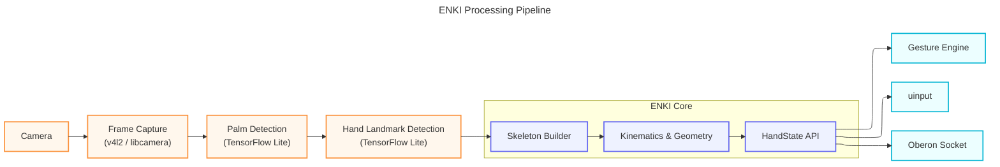
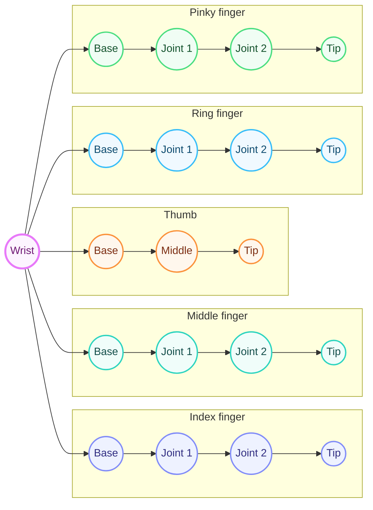
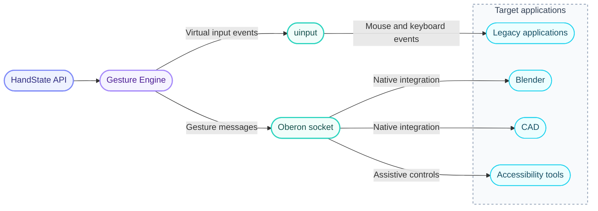
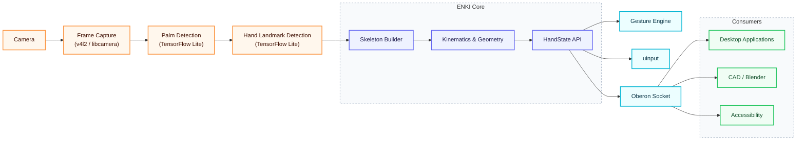

# ENKI Architecture v3 — The Hand State Model

> ENKI does not recognize gestures.
>
> ENKI understands hands.

---

## Philosophy

Most hand-tracking systems are built around one question:

> "What gesture is the user making?"

That is too limiting.

A gesture is not fundamental.

A **hand** is.

ENKI should understand the hand as a fully articulated mechanical system and expose that understanding to applications.

Gesture recognition then becomes one possible consumer of that data.

---

## The Core Idea

The camera is only the sensor.

TensorFlow Lite is only the detector.

Neither of these are ENKI.

ENKI begins **after landmark detection**.

Instead of thinking:

```text
Camera
    ↓
Gesture
```

Think:

```text
Camera
    ↓
Skeleton
    ↓
Hand State
    ↓
Applications
```

---

## The Pipeline



The neural network only tells us where the joints are.

Everything after that is deterministic geometry.

---

## Layer 1 — Skeleton

The first internal representation is nothing more than an articulated skeleton.



Each landmark becomes a joint.

Each connection becomes a bone.

No gestures.

No clicks.

No mouse movement.

Only structure.

---

## Layer 2 — Kinematics

The skeleton alone is just points.

The next layer derives meaningful physical information.

Examples include:

- joint angles
- bone lengths
- fingertip velocity
- fingertip acceleration
- wrist orientation
- palm normal
- hand velocity
- angular velocity
- confidence values

This layer is pure mathematics.

It knows nothing about applications.

---

## Layer 3 — Hand State

This is where geometry becomes semantics.

Instead of exposing only raw landmarks, ENKI builds a semantic description of the hand.

Example:

```rust
pub struct HandState {
    pub wrist: Pose,

    pub thumb: FingerState,
    pub index: FingerState,
    pub middle: FingerState,
    pub ring: FingerState,
    pub pinky: FingerState,

    pub palm_normal: Vec3,
    pub hand_velocity: Vec3,

    pub confidence: f32,
}
```

Each finger contains higher-level information.

```rust
pub struct FingerState {
    pub joints: [Joint; 4],

    pub curl: f32,
    pub spread: f32,

    pub velocity: Vec3,

    pub extended: bool,
}
```

Applications no longer need to calculate angles themselves.

ENKI already understands the hand.

---

## Layer 4 — Gesture Engine

Gestures are NOT the foundation.

They are built on top of HandState.

Instead of analyzing camera frames, the gesture engine simply asks questions.

```text
Is the index finger extended?

Is the thumb touching the index finger?

Is the palm facing upward?

Is the hand stationary?
```

A pinch becomes

```rust
thumb.tip.distance(index.tip) < PINCH_DISTANCE
&& index.extended
```

A fist becomes

```rust
all_fingers.curled()
```

A peace sign becomes

```rust
index.extended
&& middle.extended
&& ring.curled
&& pinky.curled
```

The gesture engine is therefore small, deterministic, and easy to extend.

---

## Why This Matters

Traditional systems collapse an entire hand into one label.

```text
Open Hand

Peace

Fist

Thumbs Up
```

This throws away nearly all available information.

ENKI keeps the complete hand model available.

Applications are free to decide what "gesture" means.

---

## Multiple Consumers

The Hand State is the central API.

Everything else becomes a consumer.



This allows different applications to use the same tracking data in different ways.

---

## Why Not Output Gestures Directly?

Suppose Blender wants to rotate a model based on wrist orientation.

A gesture system can only say

```text
Rotate
```

A Hand State can say

```text
Palm normal

Wrist quaternion

Finger curl

Thumb position

Angular velocity
```

The Blender plugin can implement its own controls.

No changes to ENKI are required.

---

## Relation to Linux Philosophy

Linux input devices expose events.

They do not expose intentions.

A keyboard reports

```text
KEY_A
```

not

```text
User is writing an email.
```

Likewise, ENKI should expose the hand.

Not assumptions about the user's intent.

The gesture engine is simply one interpreter of the hand state.

---

## Frame Rates

Different parts of the pipeline operate at different rates.

| Stage              | Recommended Rate         |
| ------------------ | ------------------------ |
| Camera Capture     | 30 FPS                   |
| Landmark Detection | 30 FPS                   |
| Skeleton Update    | 30 FPS                   |
| Hand State Update  | 30 FPS                   |
| Gesture Engine     | 5–15 FPS or Event Driven |
| uinput Cursor      | 60+ Hz interpolation     |
| Oberon Socket      | Configurable             |

Cursor movement requires continuous updates.

Gestures do not.

This separation reduces CPU usage while maintaining responsiveness.

---

## Future Possibilities

Once ENKI produces a reliable Hand State, entirely new capabilities become possible.

- Continuous finger tracking
- Custom gesture languages
- Gesture recording and playback
- Per-application gesture mappings
- Accessibility input systems
- CAD manipulation
- Blender sculpting
- Robotics control
- Remote hand streaming
- VR/AR integrations
- Sign language research
- Multi-hand collaboration

None of these require changes to the tracking pipeline.

Only new consumers.

---

## Design Principle

ENKI is **not** a gesture recognizer.

ENKI is a **hand understanding engine**.

Everything else is built on top of that.

---

## The Final Architecture



---

## One Sentence Mission

> ENKI transforms camera input into a high-fidelity, semantic representation of the human hand, providing Linux with a universal, hardware-agnostic hand input layer upon which gestures, applications, and future interaction models can be built.
> ↗ Up: [ENKI](ENKI.md)

## See also

- [[Design|ENKI — Design Iterations]]
- [[Architecture|ENKI Architecture v2 — The Two-Layer Split]]
